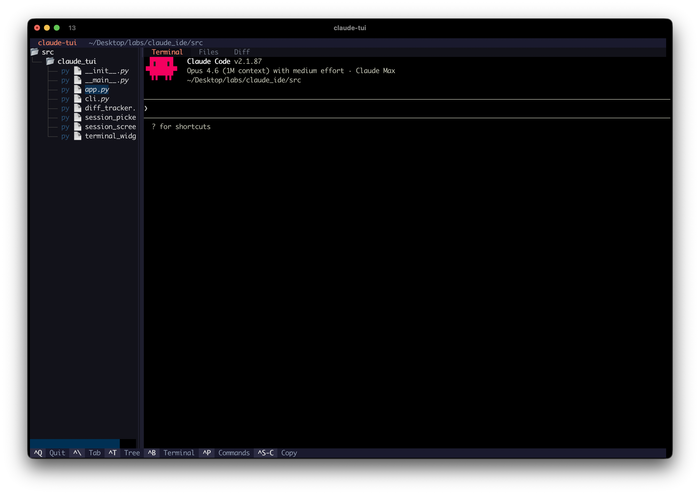

# claude-tui

Terminal UI IDE wrapper for [Claude Code](https://claude.ai/code) CLI.

Runs Claude Code inside a polished TUI with a file tree, file viewer with syntax highlighting, and a live diff navigator — while keeping **all native Claude behavior** (permissions, slash commands, interactive prompts).



## Features

- **Native Claude Code** — runs in a real PTY, everything works exactly as in your terminal
- **File tree** — browse your project with git status indicators (M/A/D/?)
- **File viewer** — syntax highlighting for 20+ languages
- **Diff navigator** — auto-detects file changes via watchdog, per-file diff view
- **Session picker** — browse and resume past sessions across all projects
- **Command palette** — `ctrl+p` for quick actions
- **Copy support** — native text selection works, plus `ctrl+shift+c` to copy terminal content
- **All Claude flags** — pass any flag directly (`--model`, `--add-dir`, `-c`, etc.)

## Requirements

- Python 3.10+
- macOS or Linux (uses PTY — not available on Windows)
- [Claude Code CLI](https://claude.ai/code) installed and authenticated
- git (optional, for diff and git status features)

## Install

```bash
# Recommended: install globally with pipx
pipx install claude-tui

# Or from source
git clone https://github.com/crlxs/claude-tui.git
cd claude-tui
pipx install .
```

For development:

```bash
git clone https://github.com/crlxs/claude-tui.git
cd claude-tui
python -m venv .venv
source .venv/bin/activate
pip install -e .
```

## Usage

```bash
# Start in current directory
claude-tui

# Start in a specific directory
claude-tui --cwd ~/my-project

# Browse and resume past sessions
claude-tui --resume

# Pass any Claude Code flag
claude-tui --model sonnet
claude-tui -c                              # continue last session
claude-tui --dangerously-skip-permissions  # skip permission checks
claude-tui --add-dir ~/other-project       # add extra directory access
```

## Keyboard shortcuts

| Key | Action |
|-----|--------|
| `ctrl+q` | Quit |
| `ctrl+\` | Cycle tabs (Terminal / Files / Diff) |
| `ctrl+t` | Focus file tree |
| `ctrl+b` | Focus terminal |
| `ctrl+p` | Command palette |
| `ctrl+shift+c` | Copy terminal content to clipboard |

All other keys are forwarded to Claude Code.

## Architecture

```
claude-tui
├── app.py              → Textual app: layout, tabs, keybindings, command palette
├── terminal_widget.py  → PTY terminal emulator (pyte + ptyprocess)
├── diff_tracker.py     → Git diff tracking with watchdog filesystem events
├── session_picker.py   → Session loader from ~/.claude/history.jsonl
├── session_screen.py   → Session picker UI (project → session → resume)
└── cli.py              → CLI entry point, flag passthrough to Claude
```

## Limitations

- **Terminal rendering**: Uses pyte (VT100 emulator) which doesn't support some modern terminal features (kitty keyboard protocol, synchronized updates). Most Claude Code output renders correctly; some decorative characters may look slightly different.
- **Windows**: Not supported — requires PTY (ptyprocess), which is Unix-only.
- **Mouse**: Mouse tracking is disabled to allow native text selection. All navigation is keyboard-driven.

## License

MIT
